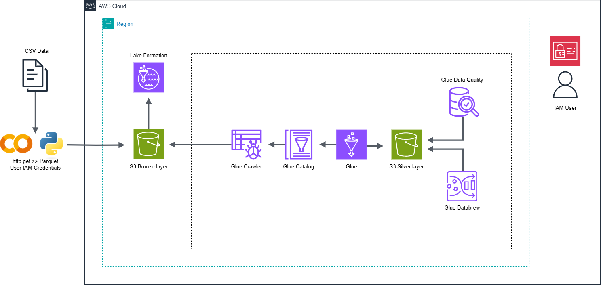
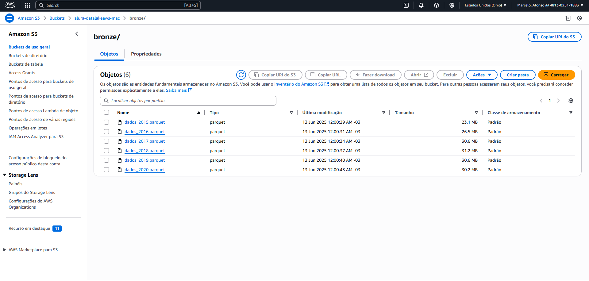
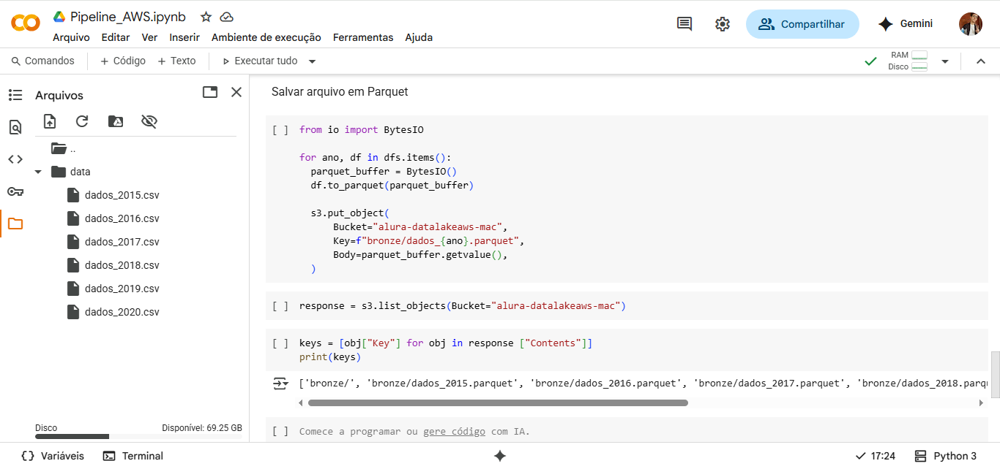
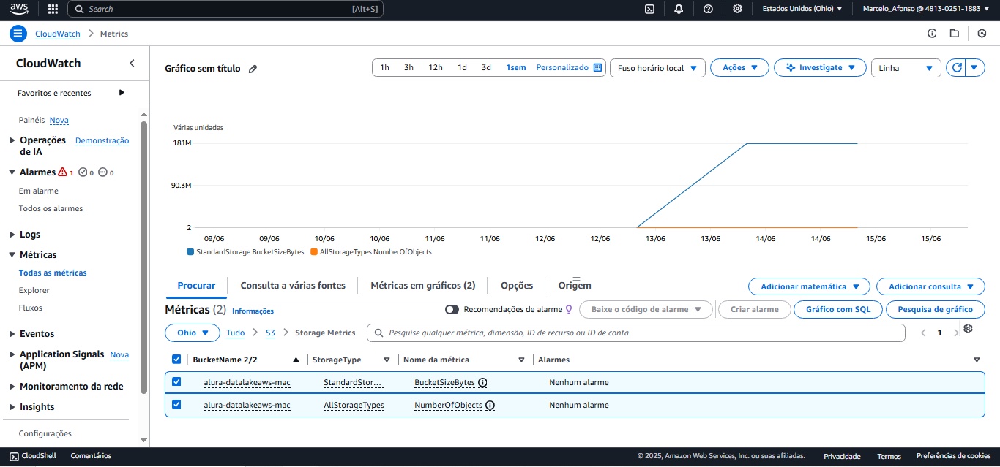
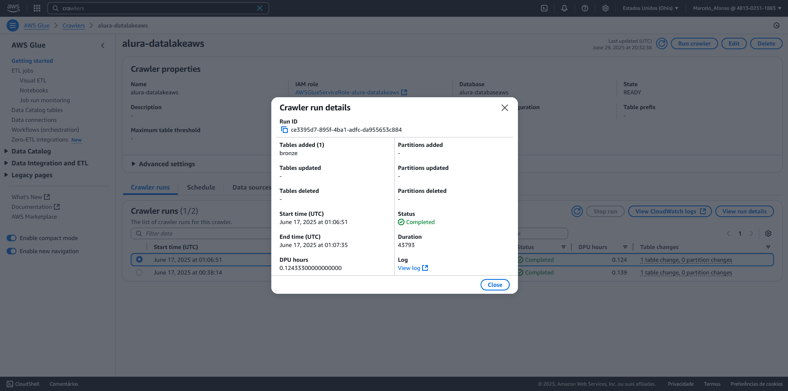
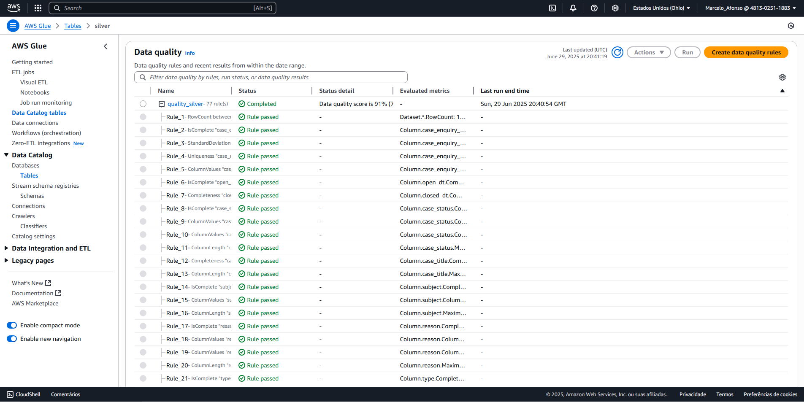
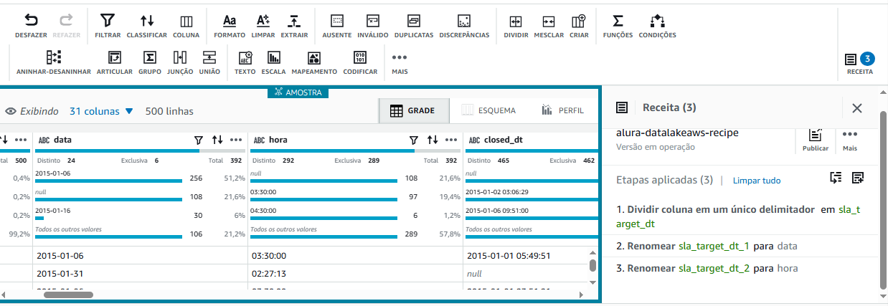
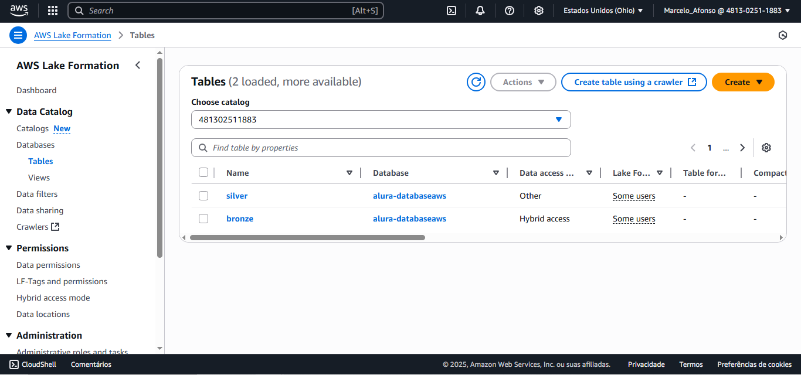

# 🏗️ Data Lake na AWS – Projeto de Estudos

<div align="center">

| Status | Formação | Instrutora |
| ------ | -------- | ---------- |
| 🚧 Em andamento | **AWS Data Lake** (Alura) | **Ana Hashimoto**

</div>

Este repositório **não** é um guia para clonar e executar uma infraestrutura localmente.  
Ele é uma **vitrine** do que aprendi ao longo da formação, reunindo trechos de código Python (sem credenciais!), prints do console AWS e explicações conceituais.

---

## 📚 Conteúdo

1. [Visão Geral](#visão-geral)  
2. [Arquitetura & Serviços](#arquitetura--serviços)  
3. [Pipeline de Dados – Camadas](#pipeline-de-dados--camadas)  
4. [Passo-a-Passo](#passo-a-passo)  
   1. [Ingestão](#11-ingestão)  
   2. [Processamento & ETL](#12-processamento--etl)  
   3. [Governança & Catálogo](#13-governança--catálogo)  
   4. [Insights & Dashboard](#14-insights--dashboard) *(próximos passos)*  
5. [Trechos de Código Python](#trechos-de-código-python)  
6. [Boas Práticas & Aprendizados](#boas-práticas--aprendizados)  
7. [Roadmap Pessoal](#roadmap-pessoal)  
8. [Créditos](#créditos)

---

## Visão Geral

> Construí uma **pipeline serverless** na AWS que ingere, processa e disponibiliza dados em formato otimizado (Parquet).  
> O projeto segue o padrão *Data Lake* (camadas bronze → silver → gold) e emprega **Infraestrutura como Código** (IaC) para facilitar reprodutibilidade.

<p align="center">
  
</p>

---

## Arquitetura & Serviços

| Camada | Serviço principal | Propósito |
| ------ | ---------------- | --------- |
| **Ingestão** | Amazon S3 + Python (`boto3`) | Armazenar dados previamente convertidos (CSV >> Parquet) na *bronze* |
| **ETL** | AWS Glue (Crawler, Jobs, Data Brew) | Catalogar, limpar e converter para Parquet na *silver* |
| **Processamento distribuído** | AWS EMR + Apache Spark | Agregações pesadas / transformação para a *gold* |
| **Consulta** | Amazon Athena | SQL serverless sobre S3 |
| **Visualização** | AWS QuickSight | Dashboards interativos |
| **Governança** | AWS Lake Formation + IAM | Segurança, RBAC e monitoramento |
| **IaC** | AWS CloudFormation / CDK | Provisionamento repetível |

---

## Pipeline de Dados & Camadas

1. **Bronze** – Dados brutos, sem qualquer transformação.  
2. **Silver** – Dados limpos, normalizados e particionados.  
3. **Gold** – Agregações e fatos otimizados para BI/Analytics.

---

## Passo-a-Passo

### 1. Ingestão

---

#### Criação do Bucket S3  
Defini a política de versionamento e o prefixo `bronze/`
<p align="center">
  
</p>

#### Coleta de dados externos
Python faz `HTTP GET`, salva localmente, converte em parquet e envia ao S3 via `boto3`
<p align="center">
  
</p>

#### Monitoramento de Custos  
Alerta de gastos + MFA para evitar surpresas

<p align="center">
  
</p>

---

### 2. Processamento & ETL

#### Glue Crawler  
Descobre esquema dos CSVs e cria tabelas no Glue Data Catalog

<p align="center">
  
</p>

#### Glue Job ETL  
Tratamento de dados, cria particionamento por ano, mês e envia ao `silver/`

<p align="center">
  
</p>

#### Data Quality
Aplica qualidade de dados de maneira simplificada de acordo com os pilares do DAMA

<p align="center">
  
</p>

#### Glue DataBrew
Tratamento de dados similar ao PowerBI, sem códigos e totalmente interativo.

<p align="center">
  
</p>

---

### 3. Governança & Catálogo

#### Lake Formation  
Define administradores e Data Lake Location

<p align="center">
  
</p>

#### Permissões Granulares  
Controle de acesso a colunas sensíveis via LF-Tags e políticas IAM.

<p align="center">
  
</p>


### 4. Insights & Dashboard *(próximos passos)*

| Planejado | Descrição |
| --------- | --------- |
| **EMR** | Completar o curso “AWS Data Lake: processando dados com EMR” |
| **Athena** | Consultar camadas silver & gold via SQL |
| **QuickSight** | Criar dashboard com storytelling e exploração guiada |

---

## Trechos de Código Python

> **⚠️ As credenciais foram removidas e substituídas por variáveis de ambiente.**  
> Siga as [práticas recomendadas de segurança](https://docs.aws.amazon.com/pt_br/sdkref/latest/guide/creds-config-files.html).

```python
# notebook/Pipeline_AWS.ipynb 

!mkdir -p data

import os
import requests
import pandas as pd
import boto3
from io import BytesIO

# -------- 1) EXTRAÇÃO --------
def extract_data(url: str, local_file: str) -> None:
    """Faz o download do CSV e salva localmente."""
    headers = {
        "User-Agent": (
            "Mozilla/5.0 (Windows NT 10.0; Win64; x64) "
            "AppleWebKit/537.36 (KHTML, like Gecko) "
            "Chrome/91.0.4472.124 Safari/537.36"
        )
    }
    resp = requests.get(url, headers=headers, timeout=60)
    resp.raise_for_status()

    os.makedirs(os.path.dirname(local_file), exist_ok=True)
    with open(local_file, "wb") as f:
        f.write(resp.content)

urls = [
    ("https://data.boston.gov/.../tmp...2015.csv", "data/dados_2015.csv"),
    ("https://data.boston.gov/.../tmp...2016.csv", "data/dados_2016.csv"),
    ("https://data.boston.gov/.../tmp...2017.csv", "data/dados_2017.csv"),
    ("https://data.boston.gov/.../tmp...2018.csv", "data/dados_2018.csv"),
    ("https://data.boston.gov/.../tmp...2019.csv", "data/dados_2019.csv"),
    ("https://data.boston.gov/.../tmp...2020.csv", "data/dados_2020.csv"),
]

for url, path in urls:
    extract_data(url, path)

# -------- 2) LEITURA --------
arquivos = [f"data/dados_{ano}.csv" for ano in range(2015, 2021)]
dfs = {path.split("_")[-1].split(".")[0]: pd.read_csv(path) for path in arquivos}

# -------- 3) ENVIO AO S3 --------
# Credenciais lidas de variáveis de ambiente ou perfil AWS CLI
session = boto3.Session(
    region_name="us-east-1",
    # profile_name="default",  # ← ou defina o profile que preferir
)
s3 = session.client("s3")

BUCKET = "alura-datalakeaws-mac"

# arquivo “hello world” (bronze de teste)
with open("hello-s3.txt", "w") as f:
    f.write("Olá, S3")
s3.upload_file("hello-s3.txt", BUCKET, "bronze/hello-s3.txt")

# dados reais em Parquet
for ano, df in dfs.items():
    buf = BytesIO()
    df.to_parquet(buf, index=False)
    buf.seek(0)

    s3.put_object(
        Bucket=BUCKET,
        Key=f"bronze/dados_{ano}.parquet",
        Body=buf.getvalue(),
    )

print("Upload concluído!")
print("Objetos no bucket:", [obj["Key"] for obj in s3.list_objects(Bucket=BUCKET)["Contents"]])

```

---

## Principais boas práticas

- **Conversão _in-memory_** → menos I/O em disco e menos espaço temporário  
- **Parquet columnar** → leitura seletiva em Athena  
- **Session do boto3** → nada de chaves hard-coded no código

---

## Boas Práticas & Aprendizados

- **Parquet & Columnar** – diminui custo de varredura  
- **Observabilidade** – CloudWatch Logs + métricas Glue  
- **Segurança** – princípio do menor privilégio (IAM & Lake Formation)  
- **Custos** – alertas de orçamento, *lifecycle rules* para arquivamento  
- **DataViz** – técnicas do livro *Storytelling com Dados* aplicadas no QuickSight  

---

## Roadmap Pessoal

- [ ] Formação Alura: Data Lake com Pipelines na AWS 
- [ ] Formação Alura: Engenharia de Analytics na AWS
- [ ] Certificação **AWS Data Engineer – Associate** até **dez / 2025**

---

## Créditos

Formação **AWS Data Lake** – [Alura](https://www.alura.com.br/)  
Instrutora: **Ana Hashimoto**  

Este README é uma síntese autoral que **não** distribui material proprietário do curso.

<div align="center">

> “Data que fica em pântano não agrega valor –  
> é a engenharia que transforma o lago em insights.”

</div>

